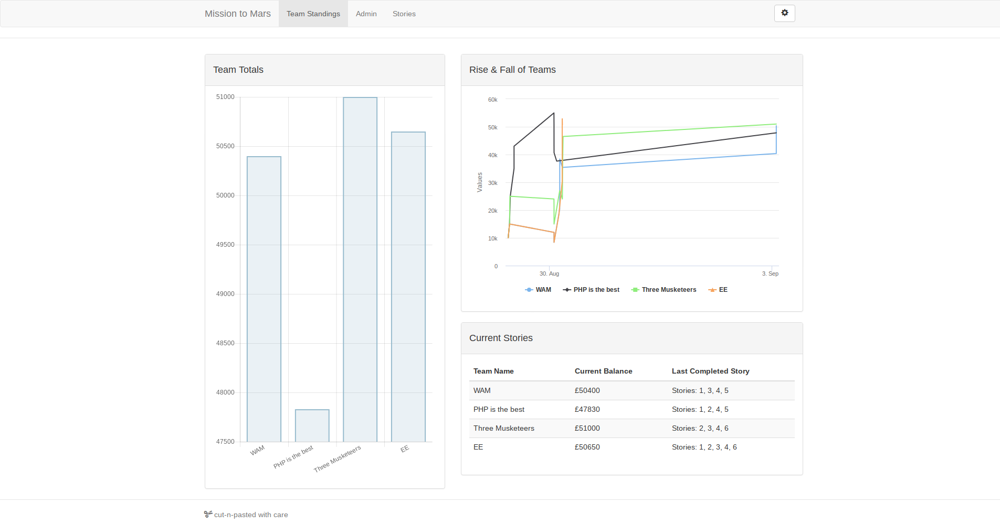

# Mission to Mars: ByteSize - Pool 2018
Code created by the participants of the Pool outing for the Mission to Mars
ByteSize program at Heartlands. Students were given the [community created starter files](https://github.com/tonyedwardspz/m2m-starter-files) and supported by mentors to complete
the provided manoeuvrability challenges.

Students code is within the main.ino files, with some making tweaks and additions
to the provided classes.

## Results
The challenges come with a core coin reward, with the prizes being totted up via
the teams dashboard.

## Usage Instructions
Clone the project locally and check out the main.ino file for starters.

The following examples will help you to begin working with the rovers. Try adding
some to the loop within the main.ino file. As you begin to develop your rover
instruction set, you'll likely want to encapsulate these groups of instructions
into functions.

### Motor Usage

**Motors Forwards**

    left_motor.forward(speed);
    right_motor.forward(speed);

**Motors Reverse**

    left_motor.reverse(speed);
    right_motor.reverse(speed);

**Turn off the motors**

    left_motor.stop();
    right_motor.stop();

### Distance Sensor Usage

Returns an integer value for the distance between the sensor and nearest object in cm.
Note: There should be a minimum delay of 50ms between each ping of the sensor.

    sensor.distance_forwards();
    sensor.distance_down();

### Light Sensor Usage

    sensor.left_light_sensor();
    sensor.center_light_sensor();
    sensor.right_light_sensor();

### Interrupt Usage

Returns an integer value for the number of pulses created by the hall effect sensor.

    left_motor.get_pulse_count();
    right_motor.get_pulse_count();
